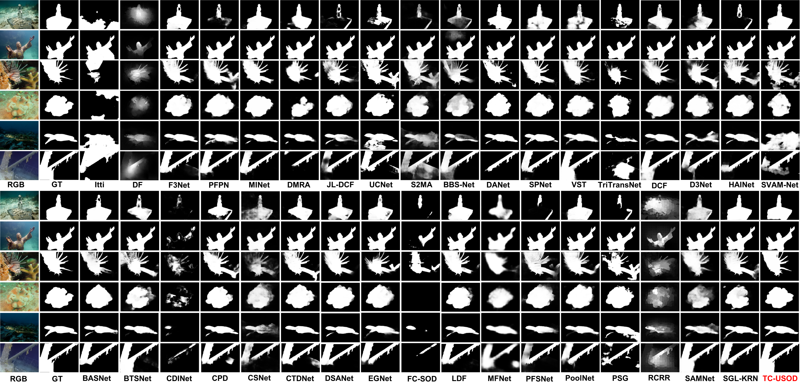

# USOD10K: A New Benchmark Dataset for Underwater Salient Object Detection


Source code and dataset for our paper “USOD10K: A New Benchmark Dataset for Underwater Salient Object Detection” by Lin Hong,  Xin Wang, Gan Zhang and Ming Zhao.

Created by Lin Hong, email: 20B953023@stu.hit.edu.cn


## Requirement
1. Python 3.8
1. Pytorch 1.6.0
2. Torchvison 0.7.0

### Our source code will released soon. !!!!

## USOD10K dataset
[USOD10K](https://pan.baidu.com/s/1XVX_3bbzLwqVjuXFp8HnIw) fetch code: [7n7b]  is the first large-scale dataset for Underwater Salient Object Detection (USOD). It is free for academic research, not for any commercial purposes.

Its folder looks like this:

````
   Data
   |-- USOD10K
   |   |-- USOD10K-TR
   |   |-- |-- USOD10K-TR-RGB
   |   |-- |-- USOD10K-TR-GT
   |   |-- |-- USOD10K-TR-depth
   |   |-- USOD10K-TE
   |   |-- |-- USOD10K-TE-RGB
   |   |-- |-- USOD10K-TE-GT
   |   |-- |-- USOD10K-TE-depth

````
We retrained 18 SOTA methods, most of the deep methods are proposed in the year of 2020 and 2021. It takes us about 750 hours to retarin these methods. 

### Saliency Maps for Comparison.


## Acknowledgement
We thank the authors of [VST](https://github.com/yitu-opensource/T2T-ViT) for providing T2T-ViT bachbone, the authors of [DPT](https://github.com/isl-org/DPT) for providing us the method to get estimated depth maps of single underwater images in [USOD10K], and [Zhao Zhang](https://github.com/zzhanghub/eval-co-sod) for providing the efficient evaluation tool.


