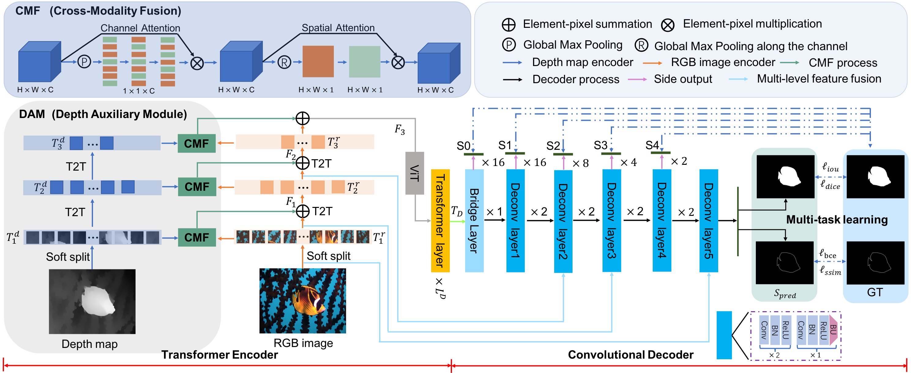

# USOD10K: A New Benchmark Dataset for Underwater Salient Object Detection


Source code and dataset for our paper “USOD10K: A New Benchmark Dataset for Underwater Salient Object Detection （IEEE T-IP 2023）” by Lin Hong,  Xin Wang, Gan Zhang and Ming Zhao.

Created by Lin Hong, email: 20B953023@stu.hit.edu.cn

## USOD10K dataset
[USOD10K](https://pan.baidu.com/s/15sXImJJooDfPF-0cTA6kIg) fetch code: [ceic]  is the first large-scale dataset for Underwater Salient Object Detection (USOD). It is free for academic research, not for any commercial purposes.

For practical training and reliable test results of deep methods on the USOD10K dataset, there should be enough samples of each category on the training set, validation set, and test set. Hence we follow the USOD10K split of roughly 7:2:1. Its folder looks like this:

````
   Data
   |-- USOD10K
   |   |-- USOD10K-TR
   |   |-- |-- USOD10K-TR-RGB
   |   |-- |-- USOD10K-TR-GT
   |   |-- |-- USOD10K-TR-depth
   |   |-- |-- USOD10K-TR-Boundary
   |   |-- USOD10K-Val
   |   |-- |-- USOD10K-Val-RGB
   |   |-- |-- USOD10K-Val-GT
   |   |-- |-- USOD10K-Val-depth
   |   |-- |-- USOD10K-Val-Boundary
   |   |-- USOD10K-TE
   |   |-- |-- USOD10K-TE-RGB
   |   |-- |-- USOD10K-TE-GT
   |   |-- |-- USOD10K-TE-depth
````
## TC-USOD baseline

### Requirement
1. Python 3.8
1. Pytorch 1.6.0
2. Torchvison 0.7.0

### Our source code will released soon. !!!!


## Benchmark
We retrained 35 SOTA methods, most of the deep methods are proposed in the year of 2020 and 2021. It takes us about 1750 hours to retarin these methods.

Retrained model are available [benchmark_pth](https://pan.baidu.com/s/1KeTrgPXl-UIz5RQR7VW6Nw?pwd=brjo) fetch code: [brjo]

Predicted saliency maps [USOD10K_predicts](https://pan.baidu.com/s/1t_fJg6luFDBD2T4H0WBY_Q?pwd=62sc) fetch code: [62sc]

Predicted saliency maps [USOD_predicts](https://pan.baidu.com/s/1E4_lvLds-J7ikbbGNfLZiQ?pwd=q75n) fetch code: [q75n]  

[Evaluation results](https://pan.baidu.com/s/1nkqfWmMjKSK-TvVX2SF4tg?pwd=k1ro) fetch code: [k1ro]  

## Acknowledgement
We thank the authors of [VST](https://github.com/yitu-opensource/T2T-ViT) for providing T2T-ViT bachbone, the authors of [DPT](https://github.com/isl-org/DPT) for providing us the method to get estimated depth maps of single underwater images in USOD10K, the authors of [SVAM-Net](http://www.roboticsproceedings.org/rss18/p048.pdf) for providing the [USOD](https://irvlab.cs.umn.edu/resources/usod-dataset) dataset, and [Zhao Zhang](https://github.com/zzhanghub/eval-co-sod) for providing the efficient evaluation tool.


